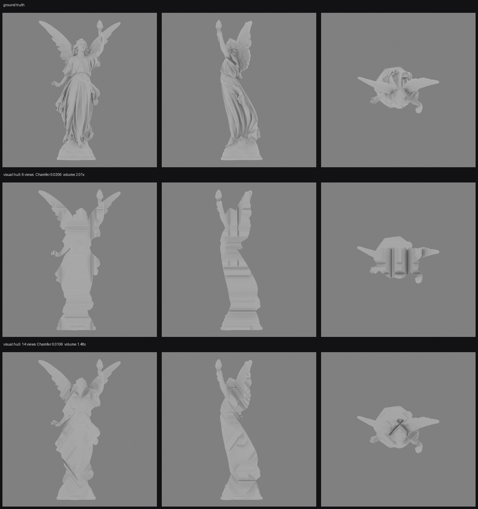

# 3d

**Goal: high-quality 3D geometry from an LLM and a pile of classical
algorithms — no learned 3D model anywhere in the geometry path.**

A language model writes the images. Everything that touches geometry is a solve
with a known answer and a scoreboard.

---

## What this is

Text-to-3D today mostly means a generative mesh model: describe a creature,
get an asset. That works, and it gives you whatever the model felt like
producing. This project takes the other road — the one where you say exactly
what the creature looks like from fourteen angles, and the geometry is
*derived* rather than sampled.

The pipeline is:

```
LLM / diffusion  ->  14 orthographic views  ->  reconstruction  ->  mesh
                     (front, back, sides,       (algorithms only)
                      top, bottom, 8 diagonals)
```

The hard part is the middle arrow. Generated views of the same creature
disagree with each other, and every fusion method that assumes they agree
explodes. This repository is mostly the record of finding out what actually
survives that.

---

## Status: reconstruction from renders alone works

Given fourteen renders of an object and nothing else, the pipeline recovers a
watertight mesh and the result is measured against the mesh the renders came
from.

Test subject: **Stanford Lucy**, 28,055,742 triangles.

| | value |
|---|---|
| **Chamfer distance** | **0.009948** (object height = 1.0) |
| **Containment** | **100.0000%** of the true surface lies inside the result |
| Volume ratio vs truth | 1.443× |
| Output | 2,777,692 triangles, watertight |
| Carve time | 61 s, CPU |
| Learned models used | **none** |

Containment is measured on 400,000 points sampled across the true surface.
Every one of them is inside the reconstruction — the result is a proven outer
bound, not an approximation that usually works.

The reconstruction cannot produce spikes, holes, flyaway geometry or divergence,
because voxels only ever leave the volume. There is no code path that adds one.



---

## The pipeline

**1. Ground-truth harness.** A Blender renderer emits six axis-aligned plus
eight diagonal orthographic views, sharing one camera scale and one centred
object, with exact silhouettes, point-sampled depth and point-sampled normals.
A validator checks that the views really describe one object — shared axes must
agree across views, depth must sit inside the normalized bounding box, normals
must be unit length.

**2. Silhouette carving.** Conservative space carving over a 261M-voxel grid.
Each silhouette is dilated by the voxel footprint before the lookup, so a voxel
survives if *any* part of it projects inside. That is what makes containment
exact rather than approximate.

**3. Surface refinement.** Normals drive a screened Poisson solve per view,
anchored on the hull as a one-sided floor, with the integration graph cut at
depth discontinuities. Carving is by quorum: several views must independently
agree a voxel is empty before it is removed.

**4. Detail.** High-frequency surface detail bakes to normal and displacement
maps rather than geometry.

---

## What the measurements found

The interesting content of this repository is the negative results. Every one
is reproducible and written up in `docs/`.

**Six orthographic views carry three silhouette constraints, not six.** Under
orthographic projection opposite views have identical silhouettes, so back,
left and bottom each carve 0.0–0.1% beyond their opposites. Eight diagonal
views were added; four of them carve, four carve nothing, for the same reason.
Chamfer halved, 0.0206 → 0.0099. ([M1](docs/M1_RESULTS.md),
[M1b](docs/M1b_RESULTS.md))

**Monocular depth estimators lose to the hull's own depth.** Marigold, MoGe-2,
Depth Anything 3 and VGGT were scored per view against the depth of the
silhouette carve that took six seconds to produce. ([M2](docs/M2_RESULTS.md),
[M2b](docs/M2b_RESULTS.md))

**Multi-view networks cannot register fourteen orthographic views.** VGGT
stacks all fourteen in one place — centroids within 0.24 while a single view
spans 1.61 — and its joint point map covers 4.28% of the true surface after
being handed a similarity transform for free. DA3 places five views within 11°
and puts the bottom view 161.5° wrong, on the far side of the object. Adding
diagonal views, which supply the overlap they supposedly lacked, changes
nothing. ([M2b](docs/M2b_RESULTS.md))

**Photometric stereo beats the learned normal estimator by five times.**

| | mean angular error |
|---|---|
| Marigold normals, ensemble 10 on a T4 | 27.80° |
| Photometric stereo, 4 known lights | **5.88°** (median 0.76°, 85.8% within 5°) |

Four renders and a 3×3 solve per pixel, published in 1980, against a diffusion
model from 2024. Single-image shape from shading has one equation and two
unknowns per pixel, which is why it needs a network to guess; adding lights
removes the need to guess rather than improving the guess.
([DEAI_PLAN](docs/DEAI_PLAN.md))

---

## Next milestone: consistency for generated input

Everything above leans on a luxury that generated images remove: the views came
from one mesh, so the cameras were exact, the silhouettes were exact, and there
was an answer key. The design for working without all three is complete and
written up in [GEN_PLAN.md](docs/GEN_PLAN.md).

**Control.** Reference chaining asks a diffusion model to be geometrically
consistent across fourteen images, which it has no mechanism to be. Instead a
rough creature is specified in code — skeleton, metaballs, limb chains — and
its depth, normals and silhouettes from the fourteen cameras become the
structural condition for generation. Fourteen renders of one object cannot
disagree about how many legs it has, so the generated images inherit that
consistency rather than having to be argued into it. Each reconstruction then
becomes the next round's proxy.

**Correction.** The proxy replaces ground truth as the consistency reference,
so views can be scored and regenerated without an external answer. Per-view
drift stays a free parameter solved jointly with the shape, now initialised
from the proxy. The safety rails need no redesign: conservative carving depends
on silhouettes being outer bounds rather than correct, and voxels still only
ever leave.

**Calibration.** Lucy's own views run through the generation path and back,
and the reconstruction is scored against Lucy. That turns every threshold —
rejection cut-off, dilation margin, carving budget — into a measured number
instead of a guess. The ground-truth harness built for the first milestone
becomes the calibration rig for the generative one.

---

## Repository

```
tools/
  render_orthoviews.py   Blender: N orthographic views, beauty + geometry passes
  inspect_gt.py          validates that a view set describes one object
  visual_hull.py         conservative space carving, axis-aligned and diagonal
  eval_hull.py           silhouette IoU, containment, Chamfer, volume
  integrate_normals.py   screened Poisson depth from normals
  discontinuity.py       edge-wise detection of depth jumps
  carve_depth.py         quorum carving from recovered depth
  photometric.py         lit renders and photometric stereo
  showcase.py            renders a mesh to be looked at rather than measured
docs/
  PLAN.md                the original design, and what measurement did to it
  M1, M1b, M2, M2b       milestone results, including the negative ones
  S2_PLAN, S2_FINDINGS   surface refinement: design and where it stands
  GEN_PLAN.md            generated input: control and correction
  DEAI_PLAN.md           removing the remaining model from the geometry path
  PROMPT_PACK.md         reference-chain prompts for manual generation
```

## Reproduce

```bash
./tools/fetch_assets.sh          # Blender + Stanford Lucy, ~1.3 GB

assets/blender/blender -b -P tools/render_orthoviews.py -- \
    --mesh assets/lucy_le.ply --out refs/lucy_gt \
    --res 2048 --samples 128 --yaw 180 --aux diagonal8

assets/blender/blender -b -P tools/inspect_gt.py -- --dir refs/lucy_gt

python3 tools/visual_hull.py --views refs/lucy_gt --out out/mesh \
    --res 1024 --smooth 1.0

python3 tools/eval_hull.py --gt-mesh assets/lucy_le.ply \
    --views refs/lucy_gt --recon out/mesh.ply --occ out/mesh_occ.npz
```

No GPU required.
