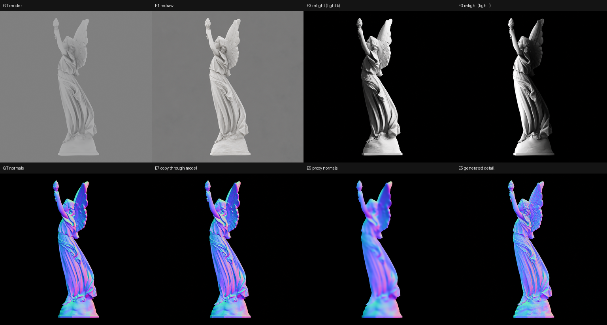

# 2D 일관성 엔진 — 능력 측정 (루시, 2026-09-24)

이미지 모델 = Codex CLI의 이미지 생성 (ChatGPT 플랜 로그인, `tools/gen_image.py`).
모두 루시 정답 렌더를 기준으로 숫자로 잼. 스크립트는 `tools/genlab/`.

| 실험 | 무엇을 | 결과 | 판정 |
|---|---|---|---|
| E1 | 정답 렌더를 그대로 다시 그리기 | 실루엣 IoU 0.994, 배율 1.0003, 이동 0.1 px, 경계 중앙값 0 px | ✅ 위치·윤곽 픽셀 단위로 복사 |
| E2 | 2패널 시트(가로 2:1) 다시 그리기 | 출력 1802×873 (패널당 ~870 px), 패널별 배율 1.000, 이동 ≤0.3 px | ✅ 시트 레이아웃 유지 |
| E3 | 조명 12개 재조명 생성 → 광도 스테레오 | 법선 중앙값 36°, 조명 방향 6~53° 어긋남, 램버트 모델과 상관 0.53 | ❌ 음영이 물리적이지 않음 |
| E4 | RGB → 노멀맵 직접 생성 | 중앙값 25°, 저주파(σ32)조차 9.6° | ❌ 단독으로는 부정확 |
| E5 | RGB + 거친 프록시 노멀 → 디테일 노멀 | 중앙값 18°, 디테일 대역 상관 0.5~0.75 | △ 그럴듯하지만 정답과 다름 |
| E6 | 두 시점 디테일이 3D에서 같은 표면인가 | 따로 생성 34°, 한 시트에 같이 33° (정답끼리 0.8°) | ❌ 시점 간 디테일 불일치 |
| E7 | 디테일한 노멀맵을 "그대로" 통과 | 중앙값 4.5°, 디테일 상관 0.90~0.99 | ✅ 고정점 존재 |



## 결론 — 설계가 바뀐다

1. **광도 스테레오 경로는 생성 입력에서 불가.** 모델은 조명을 "그럴듯하게" 그리지
   물리적으로 계산하지 않음 (E3). 법선은 모델에게 직접 노멀맵으로 받는다.
2. **시점마다 따로 만든 디테일은 서로 다른 조각상이다** (E6). 한 시트에 두 패널을
   같이 그려도 나아지지 않음. 이미지 모델에게 일관성을 "부탁"하는 방식은 한계가 분명.
3. **대신 모델은 받은 것을 매우 정확히 보존한다** (E1, E2, E7). 위치는 픽셀 단위,
   디테일한 노멀맵도 4.5°.

→ 일관성은 3D가 소유한다: **표면 페인팅 루프.**

```
프록시 메쉬 (형태 = 저주파, 정확)
 └ 표면 샘플마다 "디테일 법선" 슬롯 (처음엔 비어 있음)
for 시트 in 9장 (2뷰씩, 정면성 높은 순):
    각 패널 = 현재 표면을 그 카메라로 렌더
              (이미 칠해진 곳 = 칠해진 디테일, 빈 곳 = 프록시 법선)
    모델: "칠해진 곳은 그대로, 빈 곳에 디테일 추가"  (E7: 보존 4.5°)
    결과를 잘라 → 저주파는 프록시로 교체 → 아직 빈 표면 샘플에만 기록
최종 메쉬 = 프록시 + 칠해진 디테일 법선을 적분한 변위
최종 18뷰 이미지 = 최종 메쉬의 렌더  → 일관성은 구성상 완벽
```

- 한 표면 점의 디테일은 그 점을 처음 칠한 한 뷰에서만 옴 → 시점 간 모순이 생길 수 없음.
- 모델은 이미 칠해진 이웃을 보면서 빈 곳을 채우므로 이음매가 이어짐.
- 이미지 모델의 약점(물리, 3D 추론)은 쓰지 않고, 강점(위치 보존, 그럴듯한 디테일)만 씀.
