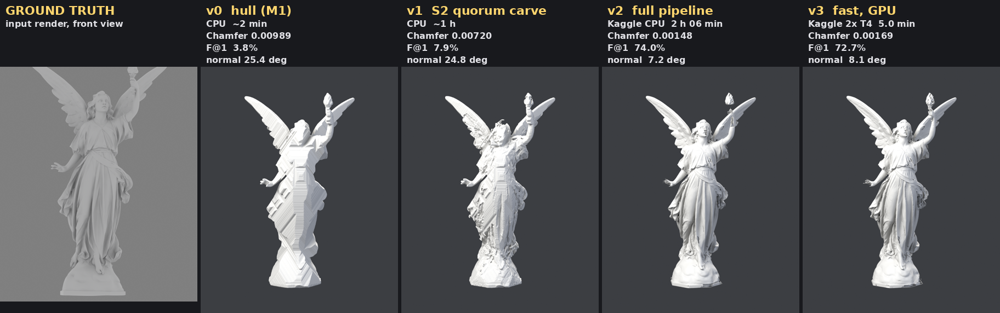
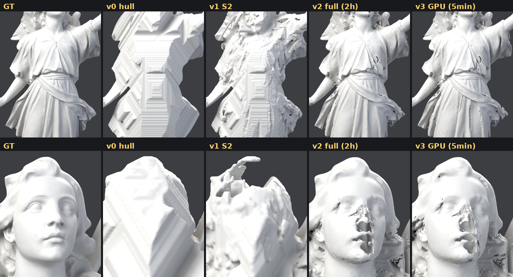

# The confirmed pipeline (v3)

Two commands, images in the middle, no learned model anywhere.

    python3 stage1.py --mesh assets/lucy_le.ply --name lucy   # mesh -> images
    python3 stage2.py --name lucy --gpu                       # images -> mesh

Stage 1 exists to produce test images from a scan; in real use the images
come from elsewhere and only stage 2 runs. Stage 2 reads nothing but
`views/{mask,rgb,cameras.json}` and `normals/`.

## Stage 2, step by step

| step | what | tool | Lucy, GPU (2x T4) |
|------|------|------|-------------------|
| 1. hull | visual hull as an exact distance field: sub-pixel silhouette contours, band-limited evaluation, sphere-traced hull depth per view | `tools/hull_field.py`, `tools/aa_sdf.py` | 0.7 min |
| 2. depth x14 | per view: robust normal integration at half resolution, absolute placement by matching normals across the other 13 views (coarse-to-fine plane sweep), re-solve against those anchors at full resolution | `tools/depth_mv.py`, `tools/normal_stereo.py`, `tools/depth_contact.py`, `tools/linsolve.py` | 3.9 min |
| 3. fuse | hull field and depth maps fused into one continuous signed distance, meshed at its zero level | `tools/fuse_field.py` | 0.4 min |
| 4. retopo | voxel remesh, QuadriFlow quad base, subdivide and shrink-wrap onto the surface | `tools/retopo.py` (Blender) | 2.1 min (CPU) |

Everything array-shaped runs on NumPy/SciPy or on CuPy through `tools/xp.py`;
`--gpu` (or `THREED_GPU=1`) picks the GPU. On four CPU cores the same run takes
about half an hour.

## Where it stands (Lucy)

| version | how | time | Chamfer | F@1 | normal median |
|---------|-----|------|---------|-----|---------------|
| v0 | silhouette hull (M1) | ~2 min | 0.00989 | 3.8% | 25.4 deg |
| v1 | S2 quorum carve | ~1 h | 0.00720 | 7.9% | 24.8 deg |
| v2 | full pipeline, original settings | 2 h 06 min (Kaggle CPU) | 0.00148 | 74.0% | 7.2 deg |
| **v3** | **confirmed: fast settings** | **5.0 min (Kaggle GPU)** | **0.00169** | **72.7%** | **8.1 deg** |

v3 against v2: 25x faster. By the numbers it gives up 1.3 points of F@1, most
of it on the skirt (93.5% to 84.7% within one voxel there). In the renders
neither the skirt difference nor any other is visible, and v3 holds the
hand under the torch together better than v2, so v3 was confirmed on sight
and the comparison stopped there.

What v3 changed from v2, each measured on its own first:

- silhouette distance from the traced 0.5 coverage contour instead of a 4x
  upsampled distance transform: 1.9 s a view instead of 44, and slightly more
  accurate on an exactly rendered disk (0.058 px against 0.067)
- linear solves at relative tolerance 1e-6 instead of 1e-10: identical to
  0.001 voxels at the 99th percentile, in 46% of the time
- the relief integrated on 2x2 blocks: 35 s instead of 315 on the front view,
  with equal or better per-view accuracy on the front and top views
- the plane sweep coarse-to-fine: 30 offsets instead of 81
- one GPU per depth worker

Measured and dropped: reusing the first IRLS round's multigrid hierarchy as a
preconditioner (slower: 183 CG iterations, 47 s against 22 s).

## Open

- holes in small, thin, protruding features -- the face, fingers, toes, the
  hand holding the torch (docs/KNOWN_ISSUES.md)
- the fused mesh sheds small floating pieces (2,771 islands on Lucy, 76k of
  3.9M faces), which retopology drops
- four CPU workers slow each other down about 2.5x; probably BLAS threads
  oversubscribing the cores, untested
