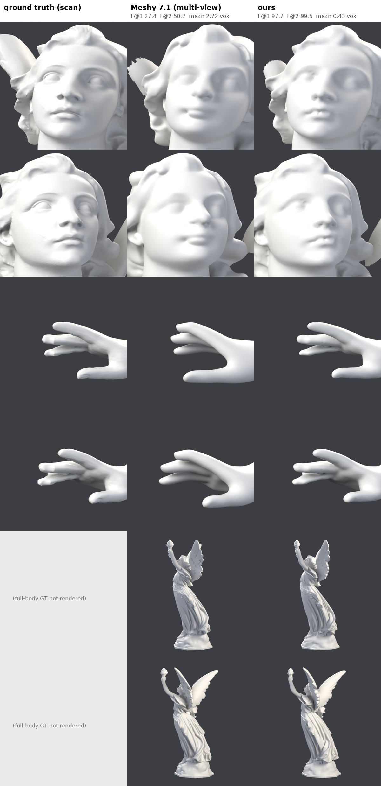

# Lucy: this pipeline vs Meshy 7.1 (multi-view)

2026-09-23. Same evaluator (`tools/eval_surface.py`), same ground-truth samples.

Meshy 7.1 (released 2026-09-10) was given multiple views of the statue; multi-view
generation runs at up to "Ultra 2K" (2048³ geometry). Its GLB (824k triangles)
was aligned to the ground truth by a similarity ICP (rotation searched every 15°,
then rotation + uniform scale + translation refined on 200k points, 10% trimmed)
— the most favourable placement we could give it.

| | F@1 | F@2 | F@5 | F@10 | mean dist | 90% dist | normal median |
|---|---|---|---|---|---|---|---|
| **ours** (14 views, 12 lights, final pipeline) | **97.7** | **99.5** | 100.0 | 100.0 | **0.43 vox** | **0.70 vox** | **3.5°** |
| Meshy 7.1 multi-view | 27.4 | 50.7 | 85.0 | 98.1 | 2.72 vox | 6.02 vox | 17.3° |

(1 voxel = 1/1024 of Lucy's height.)

By region, F@1 ours / Meshy: face 99.2 / 15.0, hand 99.3 / 22.8, torch hand
98.8 / 22.6, feet 94.2 / 34.0, hair 98.4–99.8 / 19.8–34.5, under the right
ear 97.8 / 35.1.

Reading it fairly:

- Meshy has the **shape**: at 10 voxels it is 98.1, the silhouette, pose, wings
  and drapery are all there. What it does not have is the **surface**: faces,
  fingers and hair are smoothed into plausible ones, not the statue's.
- The inputs differ. This pipeline had fourteen views with known cameras and
  twelve known lights per view; Meshy had images alone. This is our ceiling
  against their product. Roadmap items 4–5 (docs/ROADMAP.md) are about
  whether generated inputs can keep this pipeline near its ceiling.

