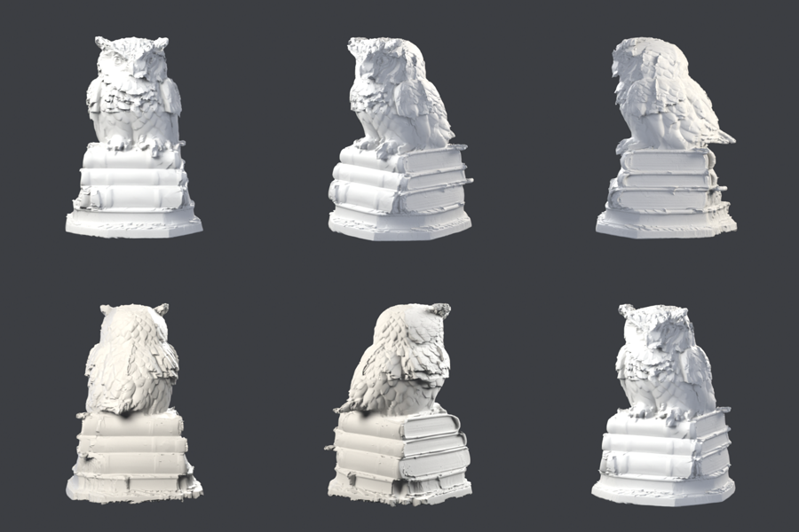
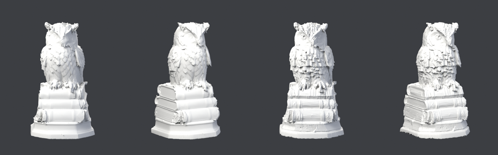
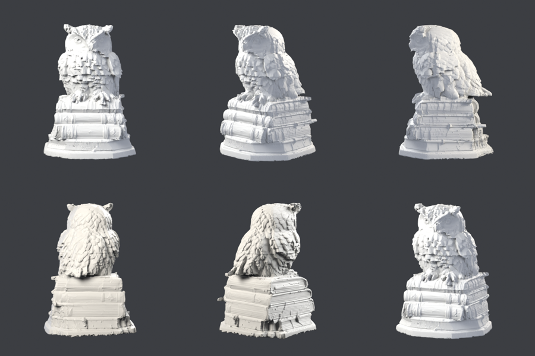
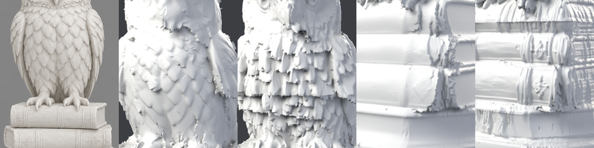
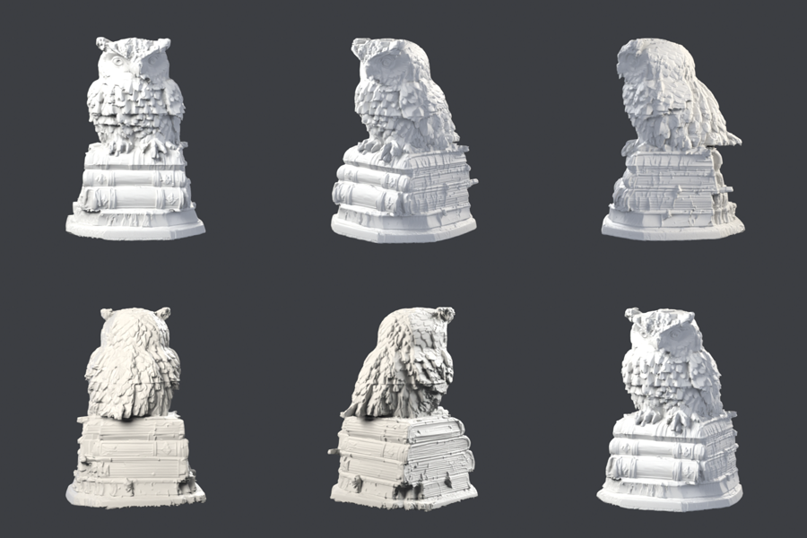
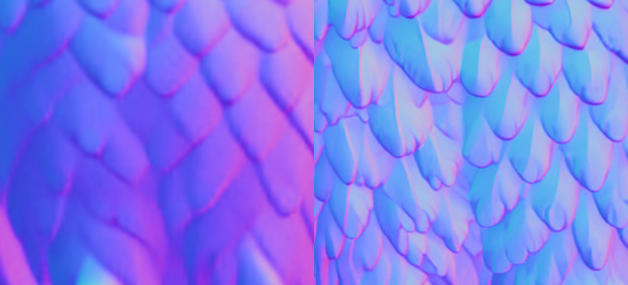
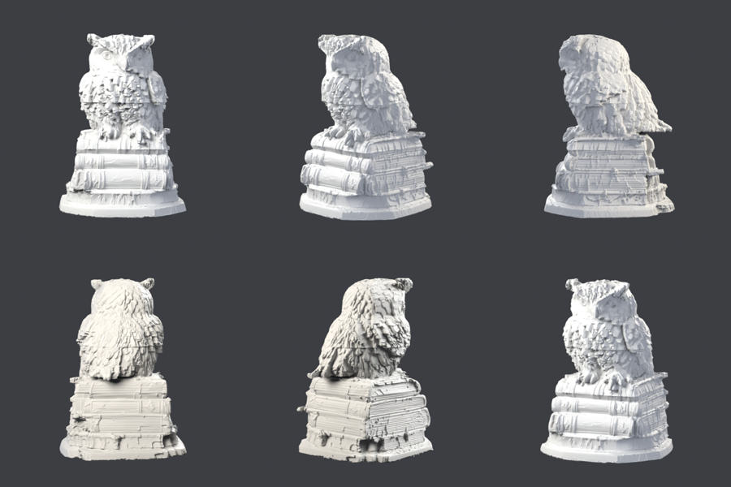
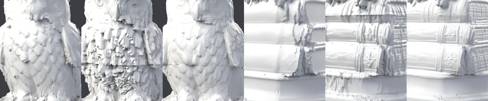
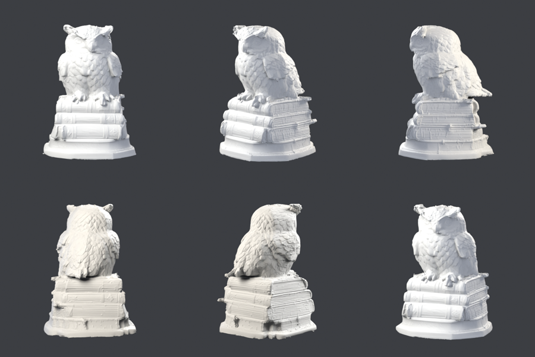

# 올빼미 야간 작업 로그

목표: 사진 한 장(`data/owl/hero.png`) → 무료 T4에서 최고 품질 메쉬. 3D 생성 모델 없이
이미지 모델(MV-Adapter, NiRNE) + 수학(`tools/mesh_fit.py`)만 사용.

## 지금까지 (2026-09-24 밤, KST)

| 버전 | 입력 | 노멀 오차(중앙값) | 실루엣 IoU | 면 수 | 비고 |
|---|---|---|---|---|---|
| 1호 | 6뷰 | 11.6° | 0.928 | 8.9만 | 얼굴 뭉개짐 |
| 2호 | 6뷰, 세분화 16배 | 9.5° | 0.929 | 145만 | 깃털 부활, 바닥 그릇 |
| 3호 | 6뷰, 박스 고정·가장자리 제외 | 8.7° | 0.976 | 126만 | 그릇 제거, 팔각 받침대 |
| **14호** | 6뷰 + 형태 조건 30뷰(확대 포함), 소유권 + 고주파만 | 9.4°* | 0.990 | 138만 | 눈·책 장식·페이지 결, 털 없음 |

\* 14호 오차는 36뷰(확대 포함) 기준이라 6뷰 기준인 3호와 직접 비교 불가. 눈으로는 14호가 확실히 위.

## 라운드 기록

(야간 작업이 여기에 계속 추가)

### 4호 — 실패, 원인 찾음 (00:08 KST)
3호 + 형태 조건 12뷰, GM 손실, 스텝마다 뷰 6개만 랜덤. 형태 단계 17°까지는 멀쩡했는데
디테일 단계에서 44°로 폭발, 온몸에 털이 남(`owl4.png`).
- GM 손실은 면이 30° 이상 틀어지면 당기는 힘이 0이 됨 → 한 번 생긴 가시가 안 돌아옴.
- 뷰를 스텝마다 랜덤으로 바꾸면 꼭짓점마다 매 스텝 다른 카메라가 당김 → 떨림.
- 고침: 디테일 단계는 항상 전체 뷰 + L1(`--detail-loss`, `--detail-views-per-step`),
  메쉬 위에 그린 뷰는 카메라가 정확하므로 고정(`--freeze-extra`),
  아무 카메라도 정면으로 못 보는 꼭짓점은 못 움직이게(`--conf-lo/--conf-hi`, 부스러기 근본 원인).

### 5호 — 털은 사라짐, 그런데 3호보다 나은 건 아님 (00:40 KST)
4호 수정 + 머리 확대 4뷰. 가시/털 없음(수정 확인). 그런데 깃털이 비늘처럼 겹겹이 들뜨고
얼굴이 3호보다 흐림. 원인: 생성 묶음(메인 6뷰, 형태 조건 링/대각, 확대 뷰)마다 깃털을
**각자 다른 자리에** 그림. 큰 형태는 같지만 깃털 무늬가 다름. 삼각형마다 "제일 잘 보이는
뷰"를 고르면 서로 다른 그림의 조각을 이어 붙이게 되어 비늘이 생김.
- 고침(`--own-cos`): 디테일 단계에서 삼각형 하나는 **한 묶음만** 따름. 그 삼각형을 정면으로
  보는 묶음 중 가장 선명한(프레임이 가장 작은) 것 → 머리는 머리 확대, 책은 책 확대,
  나머지는 메인 6뷰. 큰 형태는 전부가 함께 잡음.
- 같이 고침: 뷰를 나눠 렌더할 때 "제일 잘 보이는 뷰"를 덩어리마다 따로 고르던 버그.

### 6호 — 전체 36뷰(메인+형태 조건+머리·몸·책 확대), 소유권 없음 (00:51 KST)
실루엣 IoU 0.990(역대 최고). 확대 뷰 덕에 눈과 책 페이지 줄이 처음으로 보임.
그런데 얼굴 반쪽이 씻겨 나감: 정면 계열 뷰 셋(메인·링·확대)이 얼굴을 똑같이 잘 봐서
세 그림이 평균됨. 5호에서 찾은 원인 그대로 → 7호(소유권)로 확인 중.

### 7호 — 소유권(삼각형당 한 묶음) (01:08 KST)
소유: 머리 확대 29%, 몸 확대 21%, 책 확대 29%, 메인 4%, 링 12%, 대각 5%.
**처음으로 두 눈이 다 나옴**, 책등 장식·페이지 결이 살아남. 반면 몸 깃털이 기와처럼
각지게 들뜸(끝이 둥글지 않음). 왼쪽 두 장 3호, 오른쪽 두 장 7호:

### 8호 — 7호 + 디테일 평활 5배 (01:40 KST)
7호와 거의 같음, 약간 매끈. 기와 모양 깃털은 그대로 → 크기로 보아 디테일 단계(0.7 에지)가 아니라
**형태 단계**에서 생긴 것. 형태 단계에서는 여전히 모든 화가의 선명한 노멀이 섞이고 있었음.
→ 10호: 형태 단계에도 소유권 적용(`--own-shape`, 매 스텝 프레임 안/정면 판정으로 다시 계산).

### 9호 — 핑퐁 2라운드: 7호 메쉬 위에 5묶음(30뷰) 다시 그림 (02:05 KST)
그림 자체는 역대 최고(깃털·눈·책등 장식 선명, 윤곽 일치 0.96~0.996). 메쉬는 7호와 비슷.
**확대 비교로 원인 확정** (왼쪽부터 원본, 3호 가슴, 9호 가슴, 3호 책, 9호 책):

- 3호 가슴: 원본처럼 낮은 비늘 깃털. 9호 가슴: 가로로 너덜너덜한 술 장식.
- 9호 책: 장식 문양 생김(3호엔 없음) — 확대 뷰는 **디테일 단계**에선 이득.
- 결론: 확대 뷰의 선명한 깃털 노멀이 **형태 단계**의 굵은 메쉬(8mm 에지)에 들어가면 새길 수가
  없어서 접혀 술이 됨. 게다가 9·10호는 이미 털 난 7호에서 출발.
- 얼굴 반쪽이 평평해 보이던 건 미리보기 조명 탓(정답 노멀 자체가 부리에서 꺾이는 두 면,
  옆에서 보면 눈 있음) — 기하 문제 아님.
- → 11호: 3호(깨끗한 것)에서 출발, 확대 뷰는 형태 단계엔 윤곽만(`--shape-skip-zoom`),
  노멀은 디테일 단계에만 소유권으로.

### 10호·11호 — 여전히 술 장식 (02:35 KST)
10호(형태 단계 소유권, 7호 출발): 그대로 털북숭이. 11호(3호 출발, 확대 뷰는 형태 단계에 윤곽만):
여전히 확대 뷰가 맡은 곳마다 너덜너덜 + 머리/몸 확대 경계에 가로 이음매 → **디테일 단계**의
확대 노멀 자체가 문제.

**진짜 원인** — 같은 가슴 부위의 정답 노멀, 왼쪽 메인 정면 / 오른쪽 몸 확대:

1. 화가는 확대해도 깃털을 **화면 기준 같은 크기**로 그림 → 월드 기준 2.4배 작고 촘촘한 깃털.
2. 확대 노멀 전체가 **위로 기울어 있음**(하늘색 기운). 윤곽 안에 갇힌 표면이 "전부 위를 봐라"를
   따르려면 계단식 기와밖에 답이 없음 → 가로 술 장식의 정체.

고침(`--hp-world`): 디테일 단계 목표 노멀에서 1cm보다 큰 기울기는 **형태 단계가 정한 모양의
노멀로 교체**, 뷰에서는 가는 결만 가져옴. 디테일은 모양을 다시 따지지 않고 결만 새김.
→ 14호(11호 + 이것), 13호(확대 뷰 없이 링·대각만, 대조군), 12호(헐에서 새로 시작).

### 12·13·14호 — 돌파 (03:10 KST)
- 12호(헐에서 새로, 고침 전): 역시 털북숭이.
- 13호(대조군: 확대 뷰 빼고 링·대각만): 깨끗함, 3호 수준 → 털의 범인은 확대 노멀 확정.
- **14호(11호 + `--hp-world 0.01`): 디테일 노멀 오차 18° → 9.4°로 반토막.** 가슴 비늘 깃털
  깨끗, 책등 장식 문양·페이지 결·두 눈 전부 살아 있고 부스러기 대폭 감소. **새 최고 기록.**

확대 비교 (가슴: 3호 / 11호 / 14호, 책: 3호 / 11호 / 14호):

남은 것: 확대 뷰 경계의 이음매 선(가슴 가로줄), 팔각 받침대, 귀깃 끝.
→ 16호: 경계에서 다음 묶음이 서서히 섞이는 띠(`--own-band`). 핑퐁 3라운드: 14호 위에 다시 그리기.

(7호 당시 계획) 8호 = 7호 + 디테일 평활 5배(깃털 끝 둥글게), 핑퐁 2라운드 = 7호 메쉬 위에
링·대각·확대 3묶음을 **다시** 그림(모든 화가가 같은 깃털 자리를 따라 그리게 → 묶음 간 불일치 감소).

## 다음 할 일 (순서대로)

1. 4호 결과 확인: 3호 + 형태 조건 12뷰(ig2mv, 위/아래 포함), GM 합의 손실.
2. 머리 확대 뷰(owlzoom, 머리만 자른 레퍼런스)를 노멀 추출 후 추가 → 5호.
3. 핑퐁 2라운드: 가장 좋은 메쉬로 ig2mv 12뷰 다시 그리기 → 노멀 → 재조각.
4. 속도: mesh_fit에서 스텝마다 뷰 일부만 렌더(확률적 샘플링).
5. 아침: 최고 결과로 Cycles 고품질 렌더 + 확대 컷 + 요약.
