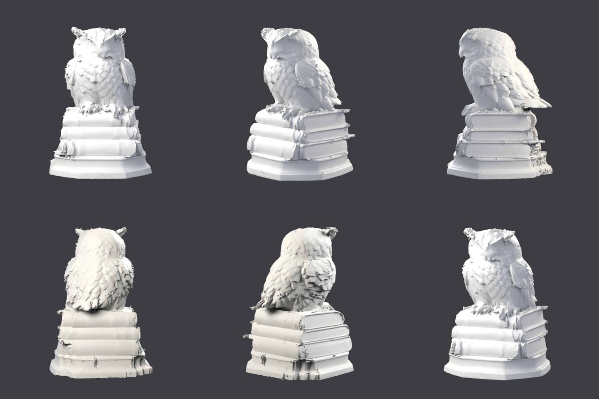
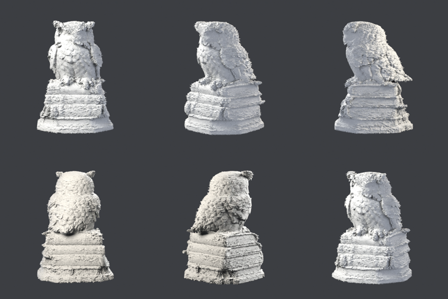

# 올빼미 야간 작업 로그

목표: 사진 한 장(`data/owl/hero.png`) → 무료 T4에서 최고 품질 메쉬. 3D 생성 모델 없이
이미지 모델(MV-Adapter, NiRNE) + 수학(`tools/mesh_fit.py`)만 사용.

## 지금까지 (2026-09-24 밤, KST)

| 버전 | 입력 | 노멀 오차(중앙값) | 실루엣 IoU | 면 수 | 비고 |
|---|---|---|---|---|---|
| 1호 | 6뷰 | 11.6° | 0.928 | 8.9만 | 얼굴 뭉개짐 |
| 2호 | 6뷰, 세분화 16배 | 9.5° | 0.929 | 145만 | 깃털 부활, 바닥 그릇 |
| 3호 | 6뷰, 박스 고정·가장자리 제외 | 8.7° | 0.976 | 126만 | 그릇 제거, 팔각 받침대 |

## 라운드 기록

(야간 작업이 여기에 계속 추가)

### 4호 — 실패, 원인 찾음 (00:08 KST)
3호 + 형태 조건 12뷰, GM 손실, 스텝마다 뷰 6개만 랜덤. 형태 단계 17°까지는 멀쩡했는데
디테일 단계에서 44°로 폭발, 온몸에 털이 남(`owl4.png`).
- GM 손실은 면이 30° 이상 틀어지면 당기는 힘이 0이 됨 → 한 번 생긴 가시가 안 돌아옴.
- 뷰를 스텝마다 랜덤으로 바꾸면 꼭짓점마다 매 스텝 다른 카메라가 당김 → 떨림.
- 고침: 디테일 단계는 항상 전체 뷰 + L1(`--detail-loss`, `--detail-views-per-step`),
  메쉬 위에 그린 뷰는 카메라가 정확하므로 고정(`--freeze-extra`),
  아무 카메라도 정면으로 못 보는 꼭짓점은 못 움직이게(`--conf-lo/--conf-hi`, 부스러기 근본 원인).

## 다음 할 일 (순서대로)

1. 4호 결과 확인: 3호 + 형태 조건 12뷰(ig2mv, 위/아래 포함), GM 합의 손실.
2. 머리 확대 뷰(owlzoom, 머리만 자른 레퍼런스)를 노멀 추출 후 추가 → 5호.
3. 핑퐁 2라운드: 가장 좋은 메쉬로 ig2mv 12뷰 다시 그리기 → 노멀 → 재조각.
4. 속도: mesh_fit에서 스텝마다 뷰 일부만 렌더(확률적 샘플링).
5. 아침: 최고 결과로 Cycles 고품질 렌더 + 확대 컷 + 요약.
